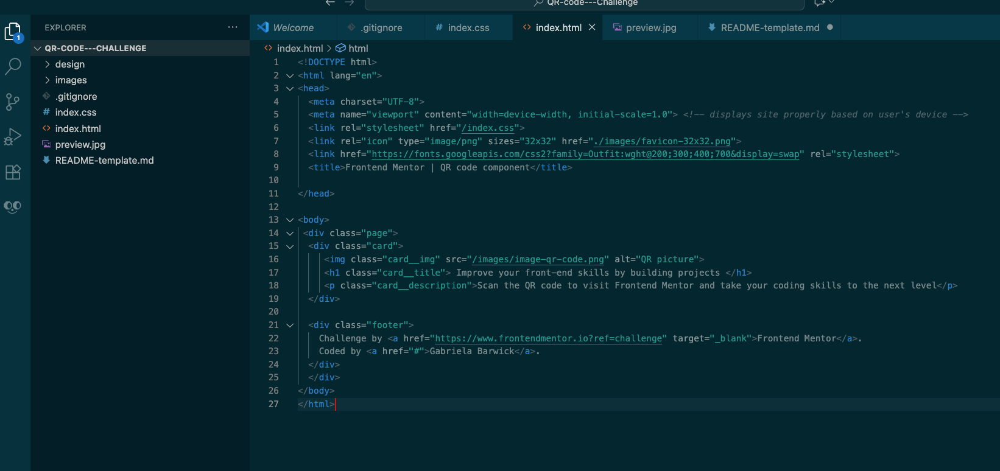
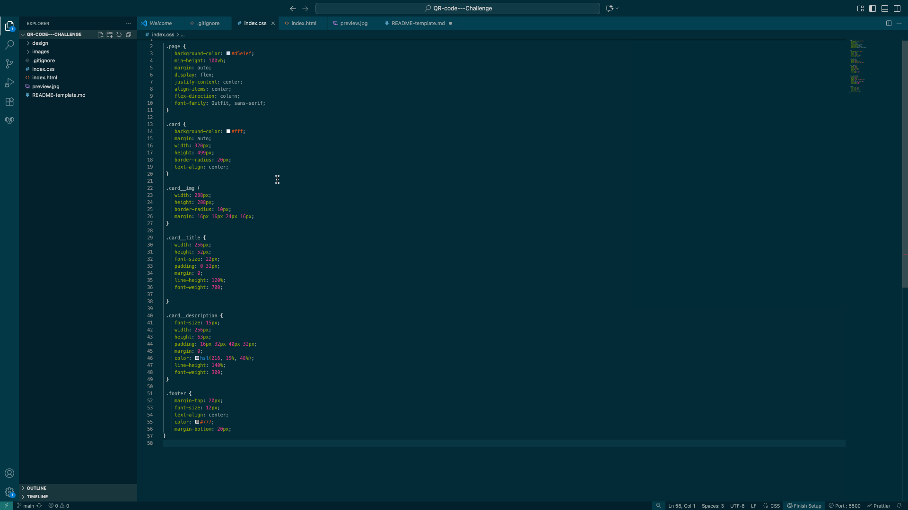

## Table of contents

- [Overview](#overview)
  - [Screenshot](#screenshot)
  - [Built with](#built-with)
  - [What I learned](#what-i-learned)
- [GitHub](#Link-to-the-project)

## Overview

This is a small project I built as part of a Frontend Mentor challenge. The goal was to recreate a simple QR code card using only HTML and CSS. At first glance, it looks easy but it was a great exercise in paying attention to spacing, font weights, and layout precision.

### Screenshot

### Built with

- Semantic HTML5 markup
- CSS 
- Flexbox
- CSS Grid
- Positioning
- BEM file structure
- Google Fonts

### What I learned

Even though this is a small component, I reinforced several key frontend concepts:

- How to use Flexbox to center content vertically and horizontally.
- Working with Google Fonts and loading different font weights properly.
- Fine-tuning visual details like `border-radius`, padding, and color contrast using HSL/RGBA.
- Structuring clean and semantic HTML.

It also helped me practice creating pixel-perfect layouts based on a design reference.

## Link to project on GitHub Pages

* [Link to the project](https://github.com/GabrielaB3/QR-code---Challenge.git)

